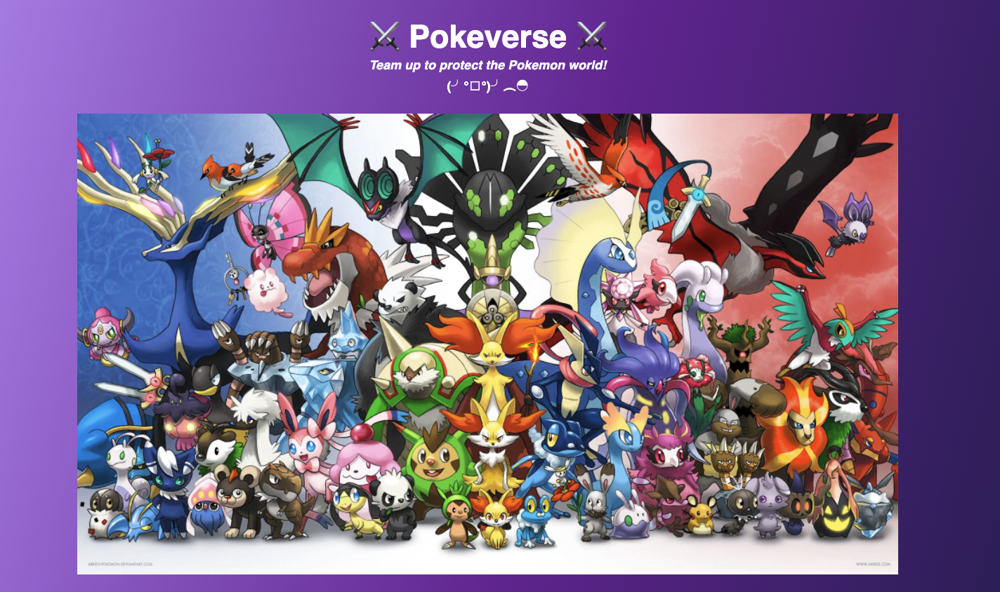

# NFT Turn-Based Card Game v2

- See [website](https://nft-turn-based-card-game.vercel.app/)
- Contract Address: [0x5E322636F837A38e16D6F202e10629AAcECA258c](https://rinkeby.etherscan.io/address/0x5E322636F837A38e16D6F202e10629AAcECA258c#code)
- This project is a card-based nft game inspired by [@buildspace](https://app.buildspace.so/)
- Built with `solidity` `brownie` `react` `javascript` `ethers` `tailwindcss`

# What's new in v2?

- New Look Website 🔥
- Introduce Critical Damage 💥, the player can now hit the boss with critical damage depends on random critical chance.
- Introduce Revive Feature ✨, the player can now revive dead nft character
- See [version1](https://github.com/birdglove2/nft-turn-based-card-game/tree/v1/hardhat)

# How to run

## Prerequisite

    - Brownie
    - React
    - npm or yarn

## Smartcontract

##### Compile

`brownie compile`

##### Deploy on rinkeby

`make deploy` or `brownie run scripts/deploy_epic_game.py --network rinkeby`

##### Unit Test

`brownie test`

##### Integration Test

`brownie test --network rinkeby`

## Website:

`cd web && npm start` and visit `http://localhost:3000`

# How to play

- Visit [website](https://nft-turn-based-card-game.vercel.app/)
- Connect your wallet with `metamask` and connect to `rinkeby` network

- Mint your character from these 3 pokemons
  

- Fight the boss, the boss has a very high Hp, so let's help defeat him together.
  

- Revive character if it dies
  

- You guys win when boss is dead
  
