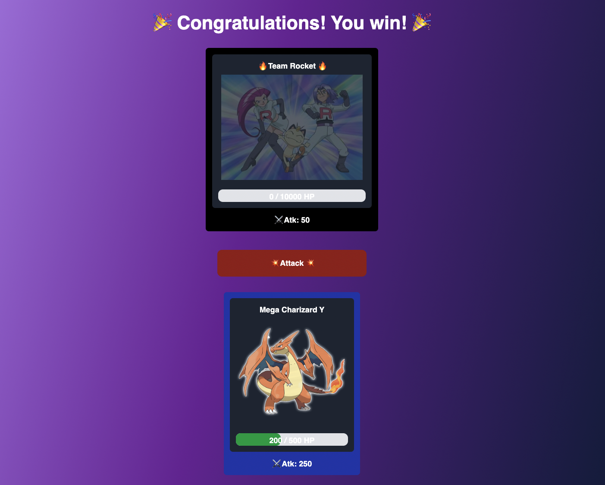

# NFT Turn-Based Card Game

- See [website](https://nft-turn-based-card-game.vercel.app/)
- Contract Address: [0x5E322636F837A38e16D6F202e10629AAcECA258c](https://rinkeby.etherscan.io/address/0x5E322636F837A38e16D6F202e10629AAcECA258c#code)
- This project is a card-based nft game inspired by [@buildspace](https://app.buildspace.so/)
- Built with `solidity` `brownie` `react` `javascript` `ethers` `tailwindcss`

## How to play

- mint your characters
  

- fight the boss, the boss has a very high Hp, so let's help defeat him together.
  

- Revive character if it dies
  

- You guys win when boss is dead
  
